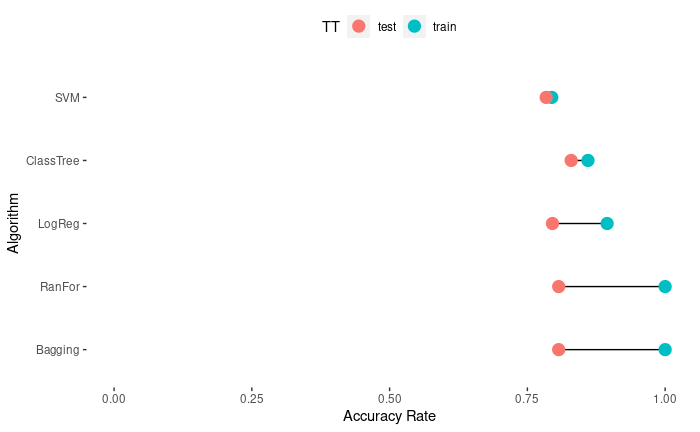

# classification

Classification Project

## Aim of the Project

In this project, I compared classification tree, bagging, random forest, logistic regression, linear discriminant analysis, quadratic discriminant analysis and support vector machine algorithms on the same data set to see which one gives better results. It will be more useful to follow the work from .Rmd files. Both [Turkish](https://github.com/ozturkfemre/classification/blob/main/TR/%5BTR%5Ds%C4%B1n%C4%B1fland%C4%B1rma_rapor.Rmd) and [English](https://github.com/ozturkfemre/classification/blob/main/ENG/%5BENG%5Dclassification_report.Rmd) .Rmd and .R and python files are available.

## Dataset Information

The dataset can be accessed in the "kmed" package with the name Heart, or it can be accessed from the [UCI Machine Learning Repository.](https://archive.ics.uci.edu/ml/datasets/Heart+Disease)

There are 14 variables and 297 observations in the data set. Each observation represents a patient. Each variable contains various information of the patient. The table below may be useful to understand what each variable means.

| variable | description                                                                                                                                                                         |
|-----------------------|-------------------------------------------------|
| age      | Age in years (numerical).                                                                                                                                                           |
| sex      | Sex: 1 = male, 0 = female (logical).                                                                                                                                                |
| cp       | Four chest pain types: (1) typical angina, (2) atypical angina (3)non-anginal pain, (4) asymptomatic (categorical).                                                                 |
| trestbps | Resting blood pressure (in mm Hg on admission to the hospital) (numerical).                                                                                                         |
| chol     | Serum cholestoral in mg/dl (numerical).                                                                                                                                             |
| fbs      | Fasting blood sugar more than 120 mg/dl (logical).                                                                                                                                  |
| restecg  | Resting electrocardiographic results: (0) normal, (1) having ST-T wave abnormality, (2) showing probable or definite left ventricular hypertrophy by Estes' criteria (categorical). |
| thalach  | Maximum heart rate achieved (numerical).                                                                                                                                            |
| exang    | Exercise induced angina (logical).                                                                                                                                                  |
| oldpeak  | ST depression induced by exercise relative to rest (numerical).                                                                                                                     |
| slope    | The slope of the peak exercise ST segment: (1) upsloping, (2) flat, (3) downsloping (categorical).                                                                                  |
| ca       | Number of major vessels (0-3) colored by flourosopy (numerical).                                                                                                                    |
| thal     | 3) normal, (6) fixed defect, (7) reversable defect (categorical).                                                                                                                   |
| class    | Diagonosis of heart disease (4 classes). It can be 2 classes by setting 0 for 0 values and 1 for non-0 values.                                                                      |

: variable information

**Data Prepration**

-   Before proceeding with the algorithms, the dependent variable was reduced to two levels: 0 for healthy, 1 for heart disease.

-   Although it is numeric, the variable ca, which behaves categorically due to its low range, has been converted to a factor.

-   The data set was divided into 70% train and 30% test data.

## Study

The Study section consists of 6 chapters: descriptive statistics, data visualization, algorithms, roc curves, comparison, and the best model

### Descriptive Statistics

In the descriptive statistics section, descriptive statistics of each variable were analysed. These analyses were made separately for categorical and numerical variables.

### Data Visualization

In this section, boxplots of numerical variables are analysed first. Plots are interpreted in detail.

Then, the boxplots of the numerical variables according to the class variable are also drawn. In this way, it was examined how the patient and healthy individuals changed in each variable.

### Algorithms

In this section, classification tree, bagging, random forest, logistic regression, linear discriminant analysis, quadratic discriminant analysis and support vector machine algorithms are applied to the dataset.

#### Classification Tree

Two R packages were used in the Classification Tree study. These packages can be listed as tree and rpart packages.

In the analysis performed with the tree package, the whole tree was first created. Then, the point where the tree will be pruned was selected with cross validation.

Since the rpart package also does the pruning itself, only one model was created.

The unpruned tree generated with the tree package, the pruned tree generated with the tree package, and the tree generated with the rpart package were compared with performance metrics and the best tree was decided.

#### Bagging

Two R packages were utilised in the bagging study. These packages can be listed as randomForest and ipred packages.

The outputs of the models created with both packages were analysed.

Then, the performance metrics of the models created with both packages were compared and the best bagging model was decided.

#### Random Forest

In the Random Forest study, the randomForest R package was used.

Then, the best parameters were decided with grid search. The following options were used in parameter selection:

-   mtry: sqrt(p) was used since it is a classification study.

-   ntree: the range where the OOB error rate decreases was selected by plotting the model.

-   nodesize: 1,3,5,10 values were tried.

After Grid Search, a second model was built with the best parameters.

Then the performance metrics of the first model and the model created after grid search were compared and the best random forest model was decided.

#### Logistic Regression

In the Logistic Regression study, the model was first established. Then, the following procedures were applied in order:

1.  Statistical significance of the model

2.  Coefficient analysis Confidence Interval for Coefficients

3.  Confidence Interval for Odds Ratio

4.  Logistic Regression Diagnosis (Outlier Analysis, Leverage Analysis, Influential Observations)

5.  Assumption Check

Then, predictions are made at three different threshold values and performance metrics are compared and the threshold that gives the best logistic regression model is decided.

#### Linear & Quadratic Discriminant Analysis

Since only numeric variables can be used in Linear Discriminant Analysis and Quadratic Discriminant Analysis algorithms, a copy of the data set consisting only of numeric variables was created for these two analyses.

Then, linear and quadratic discriminant analysis models were established and the outputs of these models were analysed.

Assumptions were checked for both models. The following procedures were performed in assumption control:

-   Multivariate Normality Tests (Henze - Zirkler, Mardia, Royston)

-   Homogeneity (Levene Test, Visual Analysis, BoxM)

#### Support Vector Machine

This section focuses on the Support Vector Machine algorithm. It is not wrong to say that it consists of 3 parts.

In the first part, the support vector classifier model was created with linear kernel. The model was tuned with direct cross validation.

In the second part, polynomial support vector classifier model was created with polynomial kernel. The model was tuned with direct cross validation.

In the third part, the support vector machine model was created with hyperplane. The model was tuned with direct cross validation.

After interpreting the outputs of all models, predictions were made and the performance metrics of the three models were compared and the best model was decided.

### ROC Curves

In this section, the best models selected for each algorithm are compared with each other. This comparison is done with ROC Curve.

### Comparison

In this section, all algorithms are compared according to performance metrics. Accuracy rate, Sensitivity, Specificity metrics were used in this comparison. A separate graph is drawn for each metric. This graph was determined to facilitate the overfit analysis.

**Plot Guide**

-   on the y-axis, there are the names of the algorithms used.
-   the x-axis shows the accuracy rate of each algorithm.
-   the yellow dot shows the accuracy rate of the model of that algorithm built with the train dataset and the red dot shows the accuracy rate of the model built with the test dataset.
-   the length of the line between the two dots indicates how different the accuracy rate is between train and test, which can give us an idea about the overfit.

### The Best Model

The best model is decided in this section by considering the performance metrics. Then, the performance metrics of the model are analysed in detail on the test set.
